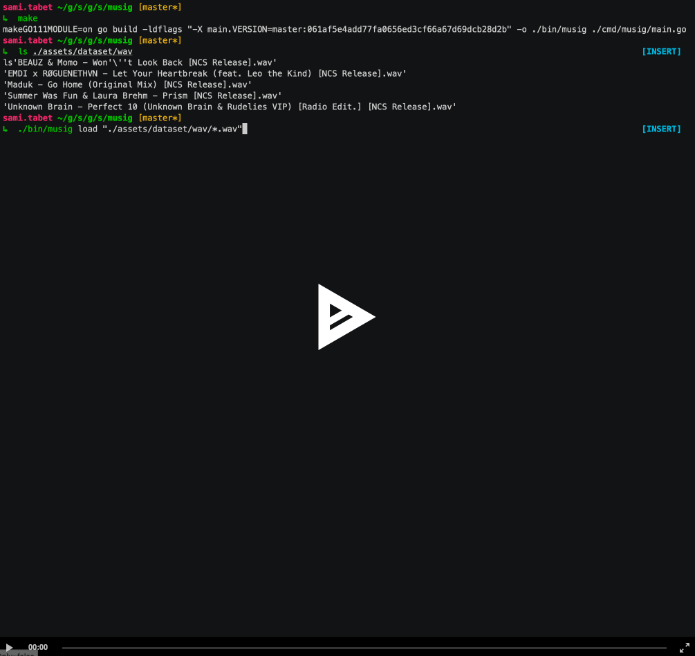

# musig :speaker:

[](https://godoc.org/github.com/sfluor/musig)
[](https://circleci.com/gh/sfluor/musig/tree/master)

A shazam-like tool that allows you to compute song's fingerprints and reverse lookup song names.

It's more or less an implementation of the shazam paper as described in [this awesome article](http://coding-geek.com/how-shazam-works/)

## Installation

You will need to have [go](https://golang.org/doc/install) on your computer (version > 1.11 to be able to use go modules).

You will also need to have [portaudio](http://www.portaudio.com/) installed (`brew install portaudio` on macOS, `apt install portaudio19-dev` on Ubuntu / Debian, for other distributions you can search for the `portaudio` package), it is required for the `listen` command that listens on your microphone to match the recording against the database.

To build the binary:

```bash
git clone git@github.com:sfluor/musig.git
cd musig
make
```

You will then be able to run the binary with:

`./bin/musig help`

## Usage



To do some testing you can download `wav` songs by doing `make download`.

Load them with `./bin/musig load "./assets/dataset/wav/*.wav"`

And try to find one of your song name with:

`./bin/musig read "$(ls ./assets/dataset/wav/*.wav | head -n 1)"`

You can also try to use it with your microphone using the `listen` command:

`./bin/musig listen`

If you want to record a sample and reuse it multiple times after you can also use the `record` command:

`./bin/musig record`

For more details on the usage see the help command:

```
A shazam like CLI tool

Usage:
  musig [command]

Available Commands:
  help        Help about any command
  listen      listen will record the microphone input and try to find a matching song from the database (Ctrl-C will stop the recording)
  load        Load loads all the audio files matching the provided glob into the database (TODO: only .wav are supported for now)
  read        Read reads the given audio file trying to find it's song name
  record      record will record the microphone input and save the signal to the given file
  spectrogram spectrogram generate a spectrogram image for the given audio file in png (TODO: only .wav are supported for now)

Flags:
      --database string   database file to use (default "/tmp/musig.bolt")
  -h, --help              help for musig

Use "musig [command] --help" for more information about a command.
```

## Testing

To run the tests you can use `make test` in the root directory.

## TODOs

- [ ] improve the documentation
- [ ] support for `mp3` files
